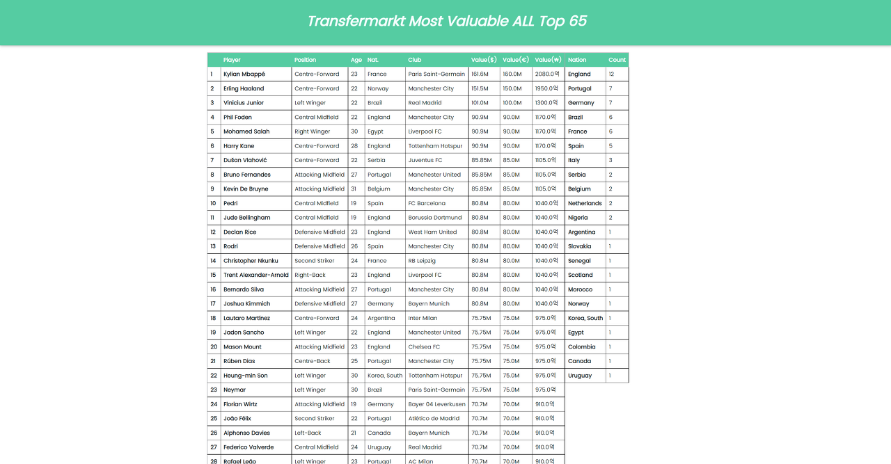
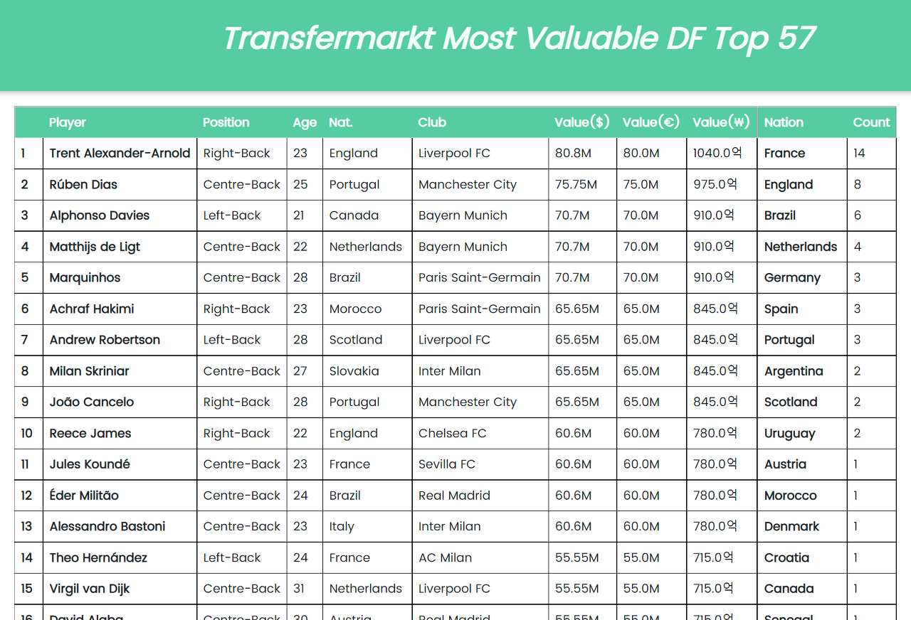

# 축구선수 몸값 크롤링 사이드 프로젝트
##  기술 스택
- 언어
  - Python
  - HTML/CSS/JS
- 프레임워크 / 라이브러리
  - Flask
  - BeautifulSoup4, pandas, requests
  - virtualenv
  
## 요약
해당 프로젝트는 Transfermarkt.com의 선수 몸값 데이터를 가져와서 원하는 조건에 맞게 데이터를 가공하여 보여주는 웹 크롤링 입니다.
사용자가 입력할 수 있는 조건은 포지션, 정렬 조건, 몸값 표시 단위이며, 단위는 원화, 달러화, 유로화 총 세 가지입니다.

## 구현 원리
1. index.html에서 입력한 값들을 POST 요청으로 넘겨 받으면 서버에서 크롤링 파일을 실행합니다.
2. 크롤링 모듈은 객체지향 방식으로 설계되어 있으며, 각각의 단계마다 순차적으로 함수들이 실행됩니다.
3. 해당 사이트의 테이블 태그들을 bs4를 통해 가져오고 이를 pandas.dataframe을 통해 새로운 테이블로 변환합니다.
4. 이때 pandas의 groupBy 기능을 사용하여 해당 선수들의 소속 국적 또한 테이블로 생성합니다.
5. 최종적으로 입력한 조건에 맞는 선수 표와 국적 표가 같이 출력되어 선수들의 몸값 현황과 국적을 확인할 수 있습니다.

## 구현 결과
### 첫 화면

### 데이터 출력 화면

### 선수 표 및 국적 표

## 개발 과정
- 개발에 대한 자세한 과정 및 소스 코드는 https://whxogus215.tistory.com/ 을 통해 확인할 수 있습니다.
 
  

